# SKALA Vue 3 실습

강의 정답지 `skala-vue-main`을 따라 만드는 데서 멈추지 않고, 궁금했던 동작을 직접 바꾸고 연결해 본 프로젝트다. 날씨 애플리케이션을 중심으로 이벤트, 폼, 배열 CRUD, Composition API, 컴포넌트 통신, Lifecycle, Pinia, Axios와 XSS 보안을 단계별로 실습했다.

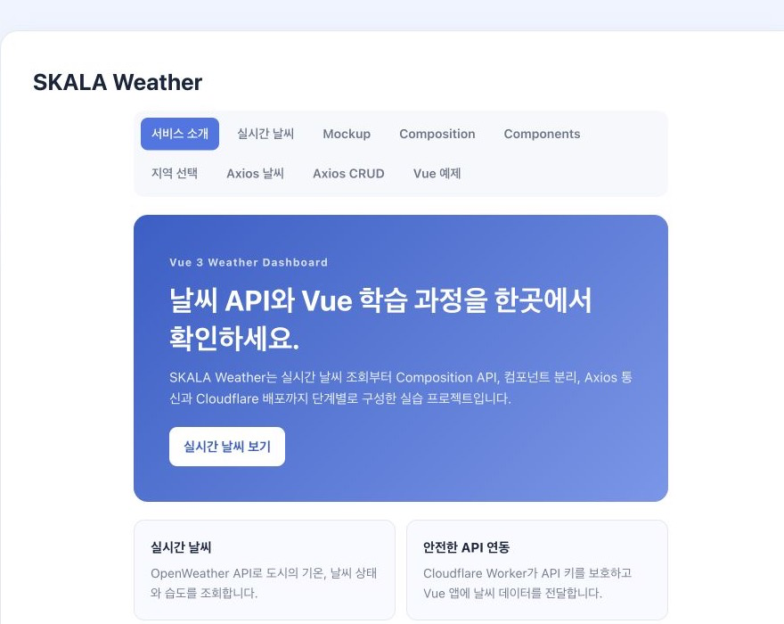

## 직접 확장한 핵심 포인트

| 차별화 포인트 | 구현 내용 | 관련 화면 |
| --- | --- | --- |
| 마우스·키보드 동시 지원 | `mouseenter`와 `focus`를 하나의 조회 흐름으로 연결하고 조회 횟수까지 반응형으로 표시 | `/regions` |
| 공용 날씨 모델과 카드 | 체감 온도·습도·구름·풍속·활동 추천을 공통 모델과 `WeatherCard`로 재사용 | `/weather`, `/components` |
| 전역 온도 단위 | Pinia 설정을 통해 여러 화면의 섭씨/화씨 표시를 한 번에 전환 | 상단 단위 토글 |
| 안전한 실시간 API 구조 | ViewModel → Axios Service → Cloudflare Worker → OpenWeather API로 책임을 분리하고 API 키를 Worker에서 보호 | `/weather` |

## 프로젝트 한눈에 보기

| 구분 | 확인 위치 | 내용 |
| --- | --- | --- |
| 앱에 연결된 기능 | 상단 메뉴의 각 라우트 | 날씨 조회, 지역 선택, 즐겨찾기, 단위 전환, Axios 화면 |
| 개별 실습 기능 | `/examples` 선택 메뉴 | 이벤트, 폼, CRUD, watcher, Props/Emit, Lifecycle |
| 이전 이력 또는 보완 중 | 아래의 ⚠️ 표시 | 3단계 온도 표시, Axios 프록시, 일부 예외 처리 |

> 아래 캡처는 실제 배포 페이지에서 기능을 실행한 결과다. 보고서에서는 구현 결과와 차별점을 먼저 확인하고, 세부 실습 과정은 각 항목에서 이어서 볼 수 있다.

## 1. 지역에 마우스를 올려 날씨 조회하기

**화면 위치:** `/regions` · **현재 상태:** 앱에 연결됨

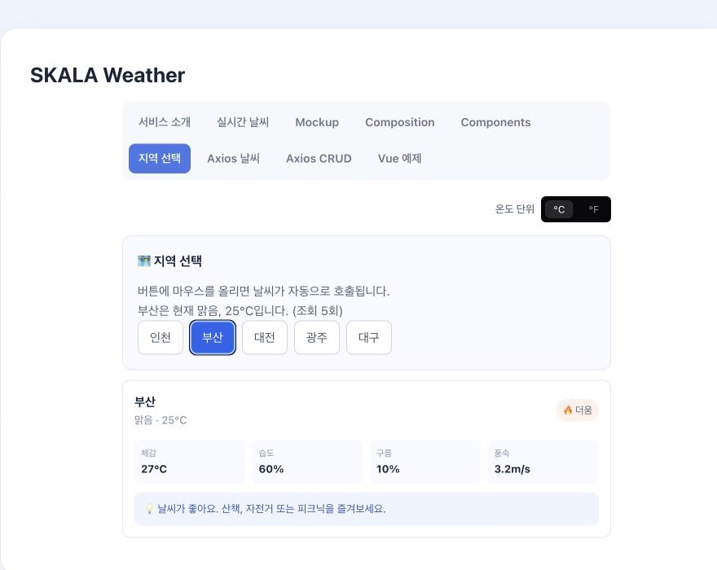

### 실습 단계

1. 정답지의 클릭 중심 날씨 선택 방식을 확인했다.
2. `WeatherRegionHover.vue`를 새로 만들고 지역 버튼을 배열로 렌더링했다.
3. `mouseenter`와 `focus`가 같은 `loadWeather` 함수를 호출하게 했다.
4. 선택된 지역은 `computed`로 찾고, 안내 문장도 별도 `computed`로 만들었다.
5. `watch`로 선택 상태와 누적 조회 횟수의 변화를 콘솔에서 확인했다.

### 구현 결과

마우스를 버튼 위에 올리거나 키보드로 focus하면 해당 지역의 날씨 카드가 나타난다. 선택 전에는 안내 문구를 보여주고, 선택 후에는 도시명·상태·기온과 조회 횟수를 함께 표시한다.

### 정답지와 다른 점

단순 클릭 이벤트를 마우스와 키보드가 함께 사용할 수 있는 상호작용으로 확장했다. 상태를 직접 조합해 출력하지 않고 `selectedCity`, `weatherMessage`라는 파생 상태로 나눈 것도 차별점이다.

### 확인한 Vue 개념

`ref → computed → template`로 이어지는 반응형 흐름과 `watch`가 상태 변화에 따른 부수 효과를 담당하는 방식을 확인했다. focus 이벤트를 함께 제공하면서 기본 접근성도 고려했다.

---

## 2. 이벤트 객체 직접 비교하기

**화면 위치:** `/examples` → `basic/EventObject` · **현재 상태:** 예제 화면에서 실행

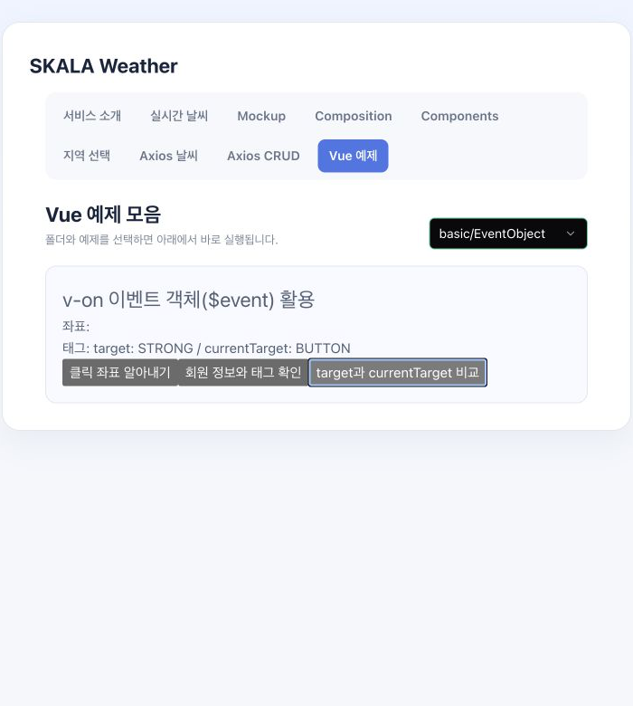

### 실습 단계

1. 정답지의 클릭 좌표와 클릭 태그 출력 기능을 실행했다.
2. 이벤트 `type`, `clientX`, `clientY`, `target`을 한 번에 표시했다.
3. `<strong>`이 들어 있는 버튼을 추가해 `target`과 `currentTarget`을 비교했다.

### 구현 결과

어떤 이벤트가 발생했는지, 화면의 어느 좌표에서 발생했는지, 실제 클릭 요소와 이벤트가 등록된 요소가 무엇인지 화면에서 비교할 수 있다.

### 정답지와 다른 점

좌표 확인에서 끝나지 않고 중첩 요소의 이벤트 버블링까지 확인했다. 실제 이벤트 위임에서 자주 혼동하는 두 대상을 직접 비교한 실험이다.

> ⚠️ 이전 커밋에는 선언만 남은 `const`가 있어 문법 오류가 발생했지만 현재는 제거되었다. 현재 `npm run build`는 통과한다.

---

## 3. 여러 입력 방식과 v-model 비교하기

**화면 위치:** `/examples` → `ModelBasic`, `ModelModifier` · **현재 상태:** 예제 화면에서 실행

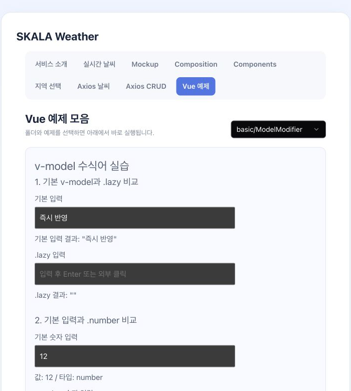

### 실습 단계

1. `ModelBasic`에서 텍스트, 단일 체크박스, 라디오, 다중 체크박스, Select를 같은 화면에 배치했다.
2. 각 입력이 문자열·불리언·배열 중 어떤 값으로 연결되는지 확인했다.
3. `ModelModifier`에서 일반 입력과 `.lazy`, `.number`, `.trim`을 나란히 비교했다.
4. `.lazy.trim`을 함께 사용해 갱신 시점과 공백 제거가 같이 적용되는지 확인했다.

### 구현 결과

입력 종류에 따라 상태의 값과 타입이 달라지는 모습을 즉시 볼 수 있다. 일반 입력과 수식어 입력을 동시에 사용해 반영 시점, 숫자 변환, 문자열 길이 차이도 비교할 수 있다.

### 정답지와 다른 점

각 수식어의 결과만 보여주지 않고 수식어가 없는 입력을 옆에 두었다. 같은 값을 입력했을 때 무엇이 달라지는지 비교하기 쉬운 실험 화면으로 바꾸었다.

### 실제 개발에서 얻은 점

폼 값은 화면상 같은 값처럼 보여도 실제 타입과 갱신 시점이 다를 수 있다. 입력 단계에서 적절한 수식어를 사용하면 제출 직전의 불필요한 변환을 줄일 수 있다.

---

## 4. 과일 목록과 Todo CRUD 구현하기

**화면 위치:** `/examples` → `VueFor`, `test` · **현재 상태:** 예제 화면에서 실행

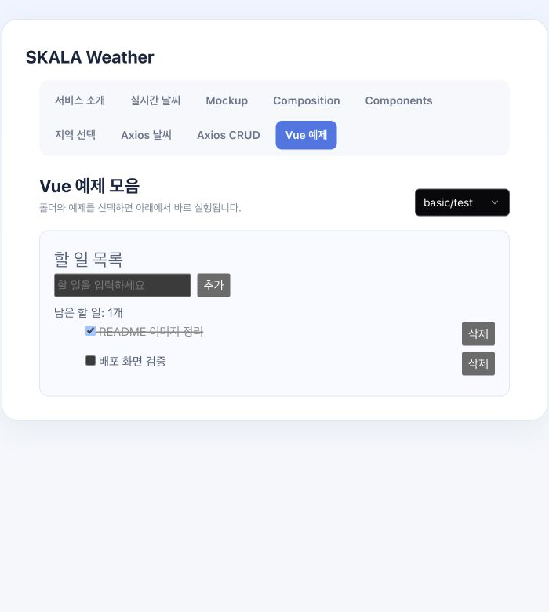

### 실습 단계

1. 정답지의 문자열 과일 배열을 `{ id, name }` 객체 배열로 변경했다.
2. 입력값을 trim한 뒤 고유 ID를 부여해 과일을 추가하고 삭제했다.
3. `test.vue`에서 Todo 등록과 체크박스 완료 처리를 구현했다.
4. ID를 기준으로 Todo를 삭제하고, `computed`로 남은 개수를 계산했다.

### 구현 결과

과일과 Todo를 화면에서 직접 추가·삭제할 수 있다. Todo 완료 상태는 체크박스와 연결되고 완료한 항목에는 취소선이 표시된다. 남은 할 일 수는 원본 배열이 바뀔 때 자동으로 다시 계산된다.

### 정답지와 다른 점

배열을 출력하는 예제를 실제 CRUD 흐름으로 확장했다. index 대신 고유 ID를 `key`와 삭제 기준으로 사용해 재정렬이나 삭제에도 항목을 안정적으로 식별한다.

> ⚠️ `test.vue`는 기능은 동작하지만 Vue 컴포넌트의 PascalCase 관례와 맞지 않는다. `TodoList.vue`처럼 역할이 드러나는 이름으로 바꾸는 것이 좋다.

---

## 5. 반응형 배열과 watcher 실험하기

**화면 위치:** `/examples` → `WatchersRefArray` · **현재 상태:** 예제 화면에서 실행

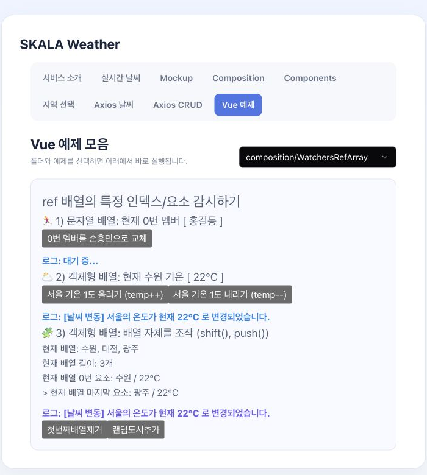

### 실습 단계

1. 문자열 배열의 첫 번째 요소를 getter로 감시했다.
2. 객체 배열의 첫 번째 도시 온도를 deep watch로 관찰했다.
3. `shift()`로 첫 도시를 제거하고 `push()`로 랜덤 도시를 추가했다.
4. 배열 길이와 첫 번째·마지막 도시가 어떻게 바뀌는지 화면에서 확인했다.

### 구현 결과

배열 요소 교체, 객체 내부 온도 변경, 배열 자체의 추가·삭제를 한 화면에서 실험할 수 있다. 변경 결과는 화면과 watcher 로그에 반영된다.

### 정답지와 다른 점

정답지의 첫 요소 변경에 `shift`, `push`, 랜덤 데이터 생성을 더해 배열의 구조 자체가 바뀌는 경우까지 테스트했다.

> ⚠️ `shift()`를 반복해 빈 배열이 되면 `cityWeather[0].name`, 마지막 요소, watcher의 `newSeoul.temp` 접근에서 오류가 날 수 있다. 길이 검사나 optional chaining이 필요하다.

---

## 6. Props/Emit으로 즐겨찾기 구현하기

**화면 위치:** `/components`, `/examples` → `PropsEmitsParent` · **현재 상태:** 앱과 예제 화면에 연결

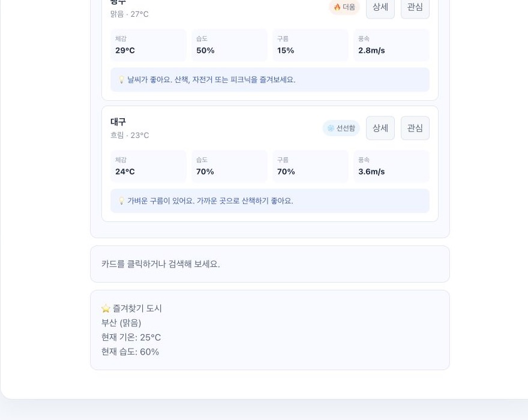

### 실습 단계

1. 정답지의 부모 Props 전달과 자식 `update-request` Emit 흐름을 확인했다.
2. `PropsEmitsChild`에 추가적인 초기화 요청 버튼을 만들어 다른 payload를 전송했다.
3. `WeatherCard`에 `favorite` Emit을 선언하고 관심 버튼에서 도시 객체를 보냈다.
4. `WeatherParent`가 이벤트를 받아 즐겨찾기 도시와 습도 정보를 표시했다.

### 구현 결과

날씨 카드의 관심 버튼을 누르면 부모 화면의 즐겨찾기 영역이 선택한 도시 정보로 갱신된다. `.stop`을 적용해 관심 버튼 클릭이 카드 선택 이벤트로 중복 처리되지 않게 했다.

### 정답지와 다른 점

문자열 갱신 예제를 실제 날씨 객체 전달로 확장했다. 자식은 사용자 행동만 알리고 상태 소유권은 부모에 남겨 단방향 데이터 흐름을 유지했다.

### 실제 개발에서 얻은 점

자식 컴포넌트가 부모 상태를 직접 변경하지 않으면 재사용하기 쉽다. 다만 초기화 요청은 현재 같은 이벤트에 다른 문자열을 보내므로 기능이 커지면 별도 이벤트나 명확한 payload 규칙이 필요하다.

---

## 7. Lifecycle과 KeepAlive 비교하기

**화면 위치:** `/examples` → `LifecycleParent` · **현재 상태:** 비교 실험 가능, 일부 보완 필요

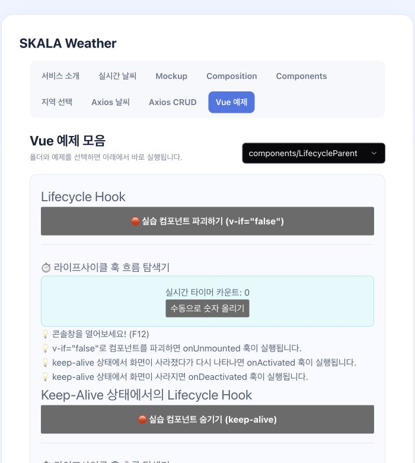

### 실습 단계

1. 정답지의 `onMounted`, `onUpdated`, `onUnmounted`와 타이머 정리를 확인했다.
2. `onActivated`와 `onDeactivated` 로그를 추가했다.
3. 일반 `v-if` 자식과 `<KeepAlive>`로 감싼 자식을 한 화면에 배치했다.
4. 컴포넌트 제거와 캐시 상태 전환에서 호출되는 훅을 비교했다.

### 구현 결과

일반 자식은 제거될 때 unmount되고 다시 생성된다. KeepAlive 자식은 인스턴스가 캐시되어 상태를 유지하며 activated/deactivated 훅이 실행된다.

### 정답지와 다른 점

마운트와 제거만 확인하던 실습을 캐시된 컴포넌트의 생명주기까지 확장했다. 화면을 잠시 숨겨도 타이머나 구독이 계속될 수 있다는 점도 확인했다.

> ⚠️ 현재 두 자식은 하나의 `isShow`를 공유해 독립 비교가 어렵다. `showNormal`, `showCached`로 상태를 나누고 deactivated 시 타이머 정책을 정하는 것이 다음 개선점이다.

---

## 8. 날씨 카드와 전역 단위 설정 확장하기

**화면 위치:** `/weather`, `/mockup`, `/composition`, `/components`, `/regions` · **현재 상태:** 앱에 연결됨

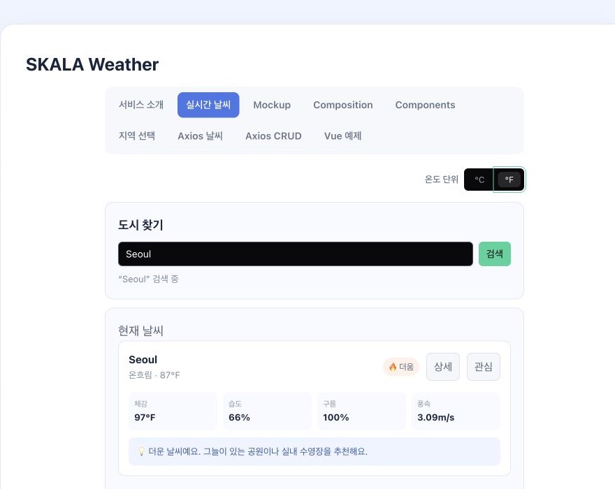

### 실습 단계

1. 정답지의 도시명·기온·상태 데이터에 전체 도시명, 체감 온도, 습도, 구름 양, 풍속을 추가했다.
2. 날씨 조건과 기온으로 활동 안내 문구를 계산했다.
3. 여러 화면이 공용 mock 데이터와 `WeatherCard`를 사용하도록 정리했다.
4. Pinia `configStore`와 `UnitToggler`를 연결해 섭씨와 화씨를 전환했다.
5. 도시 이름의 받침 유무에 따라 ‘이/가’를 붙이는 유틸리티와 테스트를 추가했다.

### 구현 결과

한 카드에서 기온뿐 아니라 체감 온도, 습도, 구름 양, 풍속과 추천 활동을 확인할 수 있다. 단위를 전환하면 관련 화면의 카드가 같은 설정을 공유해 함께 갱신된다.

### 정답지와 다른 점

화면마다 날씨 데이터를 따로 작성하는 대신 공용 모델과 카드로 연결했다. 지역 상태는 컴포넌트에 두고 여러 화면이 함께 사용하는 단위 설정은 Pinia에 둬 상태 범위를 구분했다.

### 작업 중 확인한 차이

이전 개인 작업에서는 온도를 **더움·따뜻함·선선함**의 3단계로 나눴다. 하지만 공용 `WeatherCard`로 통합한 현재 코드는 `25°C 이상=더움`, 나머지=선선함의 2단계다. 따라서 3단계 표시는 현재 완성 기능이 아니라 이전에 실험한 내용이다.

> ⚠️ 이전 파일마다 따뜻함의 시작 온도가 20°C 또는 21°C로 달랐고 일부 안내 문구도 조건과 일치하지 않았다. 현재 화씨는 `Math.round`로 정수화되므로 소수점 한 자리 표시가 필요하다면 `toFixed(1)` 등으로 정책을 명확히 해야 한다.

---

## 9. Axios 날씨 API와 오류 상태 처리하기

**화면 위치:** `/weather-api` · **현재 상태:** 화면 연결됨, API 실행 환경 보완 필요

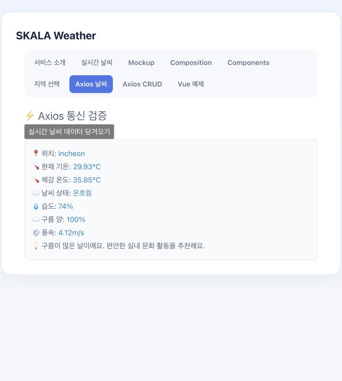

### 실습 단계

1. 정답지 컴포넌트에 직접 작성된 OpenWeather API 키를 `.env`로 분리했다.
2. URL 문자열 조합 대신 `/api/weather` 요청의 `params`로 도시를 전달했다.
3. 요청 전 로딩 상태를 켜고 버튼을 비활성화했다.
4. 성공 응답을 `toWeatherModel`로 변환하고 실패 시 오류 문구를 화면에 표시했다.
5. `finally`에서 성공 여부와 관계없이 로딩 상태를 종료했다.

### 구현 결과

사용자는 요청 중이라는 상태와 실패 이유를 화면에서 확인할 수 있다. API 응답을 화면용 날씨 모델로 바꾸어 컴포넌트가 서버의 중첩 필드를 직접 반복해서 읽지 않도록 했다.

### 정답지와 다른 점

alert 중심 오류 처리에서 로딩·성공·실패가 구분되는 UI로 확장했다. 요청 파라미터와 응답 변환도 분리해 API 연동 흐름을 더 명확하게 만들었다.

> ⚠️ 현재 컴포넌트는 `.env` 값을 직접 읽지 않고 `/api/weather` 프록시를 전제로 하지만 Vite 설정에는 프록시가 없다. 별도 서버 없이는 요청이 실패할 수 있다. 또한 `VITE_` 변수는 브라우저에 노출되므로 실제 비밀 키는 서버 환경변수로 관리해야 한다.

---

## 10. v-html과 XSS 안전성 확인하기

**화면 위치:** `/examples` → `VueHtml`, `VueHtmlXss` · **현재 상태:** 예제 화면에서 실행

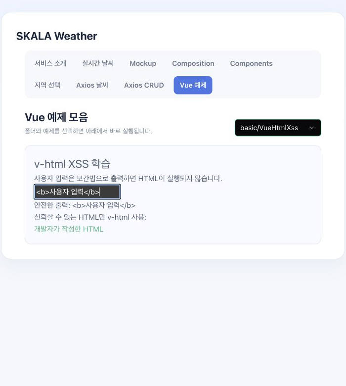

### 실습 단계

1. `VueHtml`의 HTML 문자열을 `ref`로 바꿨다.
2. 버튼을 누르면 HTML 문자열과 렌더링 결과가 함께 바뀌게 했다.
3. 정답지에서 사용자 입력을 `v-html`로 출력하던 위험한 흐름을 확인했다.
4. 사용자 입력은 보간법으로, 개발자가 작성한 고정 HTML만 `v-html`로 출력했다.

### 구현 결과

같은 문자열도 보간법에서는 문자로 표시되고 `v-html`에서는 DOM으로 렌더링되는 차이를 확인할 수 있다. 사용자 입력에 HTML 태그를 넣어도 보간법을 사용한 영역에서는 실행되지 않는다.

### 정답지와 다른 점

XSS 위험 사례를 보는 데서 끝나지 않고 안전한 출력 경로로 변경했다. ‘신뢰할 수 있는 값만 `v-html`에 전달한다’는 기준을 코드로 구분했다.

### 실제 개발에서 얻은 점

외부 HTML을 꼭 렌더링해야 한다면 보간법만으로 해결할 수 없다. 이 경우 서버 검증과 검증된 sanitizer가 필요하며, 사용자 입력을 그대로 `v-html`에 연결해서는 안 된다.

---

## 11. UI와 CSS 직접 변형하기

**화면 위치:** 날씨 카드 전체, `/examples` → `VueBindShorthand` · **현재 상태:** 앱과 예제 화면에 반영

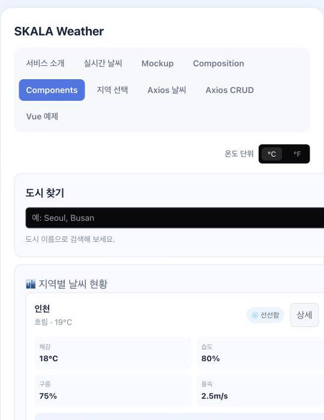

### 실습 단계

1. 정답지의 absolute 위치 기반 날씨 카드를 확인했다.
2. 카드 내부를 Flexbox로 변경해 요약, 배지와 버튼을 정렬했다.
3. 체감 온도·습도·구름·풍속 영역을 Grid로 구성했다.
4. 작은 화면에서는 지표를 두 열로 줄이는 미디어 쿼리를 추가했다.
5. `VueBindShorthand`의 이미지 너비를 ref와 연결해 버튼으로 크기를 바꿨다.

### 구현 결과

데이터가 늘어나도 카드 요소가 겹치지 않고, 화면이 좁아지면 지표 배치가 변경된다. 이미지 속성도 반응형 상태 변경에 따라 즉시 갱신된다.

### 정답지와 다른 점

고정 위치 중심의 단순 카드에서 콘텐츠 확장과 작은 화면을 고려한 유동 레이아웃으로 바꿨다. 이미지에는 `alt`, 지역 버튼에는 focus 스타일도 적용했다.

> ⚠️ 이미지 크기 버튼은 상태 변화에 반응하는 예제이지 화면 너비에 자동 대응하는 완전한 반응형 이미지는 아니다. 실제 반응형 이미지에는 `max-width: 100%; height: auto` 같은 CSS가 추가로 필요하다.

---

## 기능 외에 신경 쓴 디테일

기능이 동작하는 데서 끝내지 않고 문장 품질, 접근성, 상태의 책임, 데이터 경계와 작은 화면까지 실제 코드에서 분리해 다뤘다.

### 1. 자연스러운 문장과 접근 가능한 상호작용

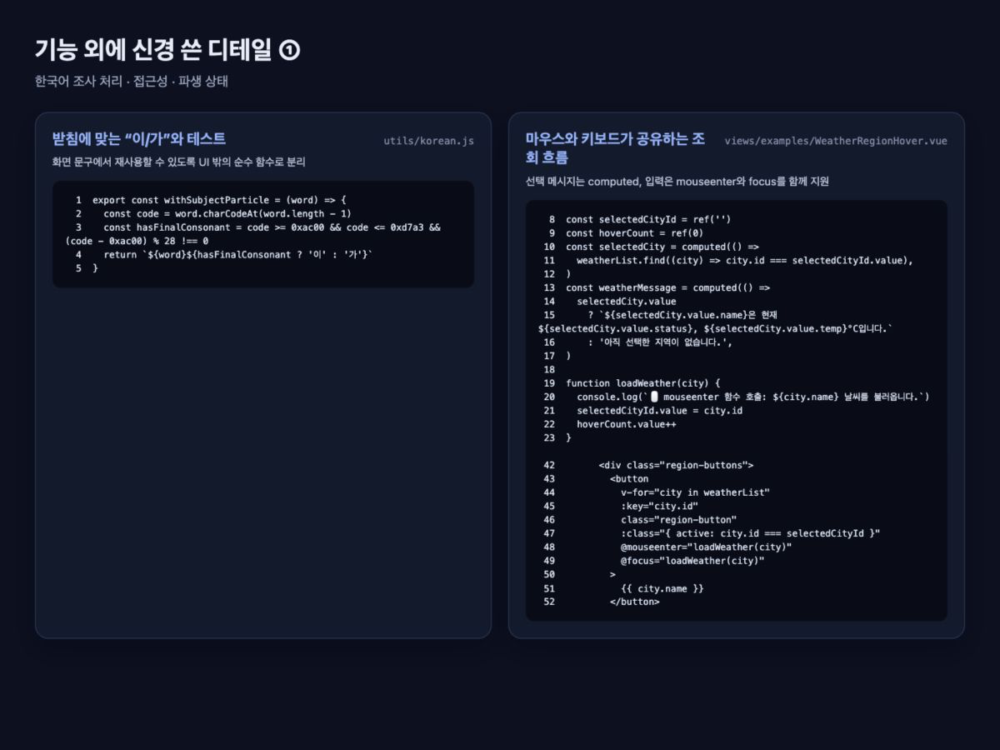

- **한국어 조사 처리:** `withSubjectParticle`이 도시명의 마지막 글자에 받침이 있는지 판별해 “서울이”, “대구가”처럼 자연스러운 선택 문장을 만든다. 순수 함수와 테스트로 분리해 다른 메시지에도 재사용할 수 있다.
- **접근성 고려:** 지역 버튼의 `mouseenter`와 `focus`가 같은 `loadWeather`를 호출한다. 마우스 없이 Tab 키로 이동하는 사용자도 동일한 날씨 정보를 확인할 수 있다.
- **파생 상태 분리:** 선택 도시와 안내 문장은 `computed`로 계산한다. 원본 상태와 화면용 문구를 따로 저장할 때 생길 수 있는 불일치를 줄였다.

### 2. 안정적인 상태와 재사용 가능한 컴포넌트

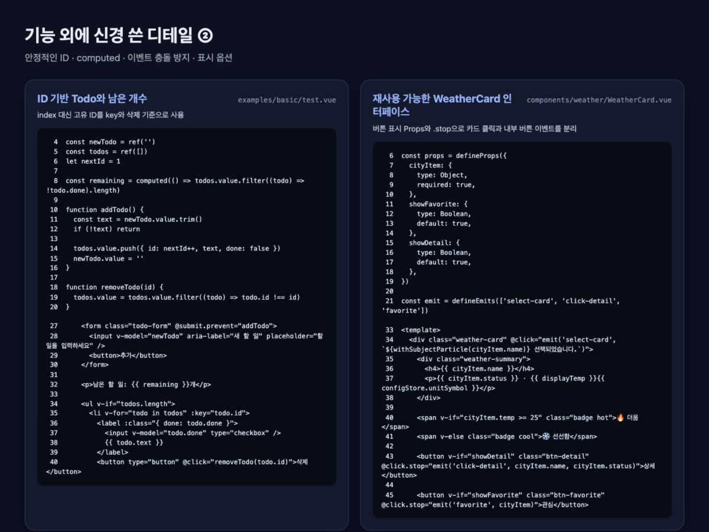

- **안정적인 목록 식별:** 과일과 Todo에 고유 ID를 부여하고 `:key`와 삭제 기준으로 사용했다. 삭제나 순서 변경 후에도 Vue가 같은 항목의 DOM을 안정적으로 추적한다.
- **파생 상태 분리:** 남은 Todo 개수는 별도 상태가 아니라 원본 배열에서 `computed`로 계산한다.
- **이벤트 충돌 방지:** 상세·즐겨찾기 버튼의 `@click.stop`이 내부 버튼 클릭이 카드 전체 선택 이벤트로 전파되는 것을 막는다.
- **컴포넌트 표시 옵션:** `showFavorite`, `showDetail` Props로 화면마다 필요한 버튼만 표시하면서 하나의 `WeatherCard`를 재사용한다.

### 3. 화면과 API 사이의 데이터 경계

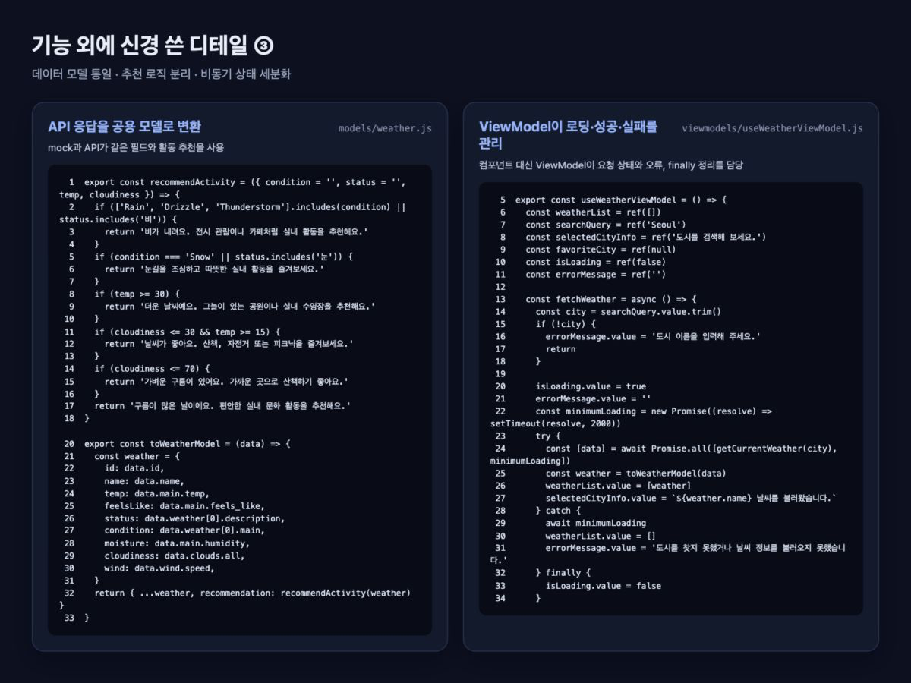

- **데이터 모델 통일:** `toWeatherModel`이 OpenWeather 응답을 mock 데이터와 같은 도시명·체감 온도·습도·구름·풍속 구조로 변환한다. 컴포넌트는 데이터 출처를 알 필요가 없다.
- **날씨 안내 로직 분리:** `recommendActivity`가 날씨 상태와 온도에 따른 추천 문구를 담당한다. 화면의 조건문을 줄이고 테스트에서 맑음·비 등의 경계 조건을 확인한다.
- **비동기 상태 세분화:** ViewModel이 입력 검증, 로딩, 성공, 오류와 `finally` 정리를 담당한다. 버튼 비활성화와 상태 메시지가 같은 요청 상태를 사용한다.

### 4. 전역 상태·보안·반응형 범위 판단

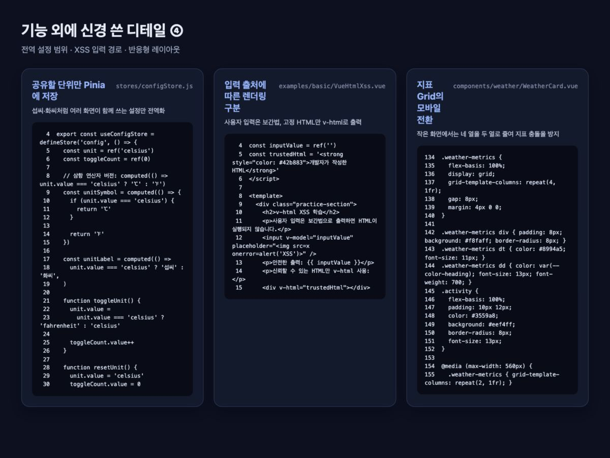

- **전역 설정의 범위 판단:** 여러 화면이 공유하는 섭씨·화씨 설정만 Pinia Store에 두고 선택 도시와 검색어는 각 화면의 로컬 상태로 유지했다.
- **XSS 입력 경로 구분:** 사용자 입력은 자동 escaping되는 보간법으로 출력하고 개발자가 작성한 고정 HTML만 `v-html`에 전달한다.
- **반응형 레이아웃 고려:** WeatherCard는 Flexbox와 Grid로 구성하고 560px 이하에서 지표를 네 열에서 두 열로 줄인다.

## 이번 실습에서 발전한 점

- `ref`에 원본 상태를 두고 `computed`로 화면용 값을 만드는 흐름을 이해했다.
- 배열 CRUD를 구현하며 고유 ID와 안정적인 `key`의 필요성을 확인했다.
- Props/Emit과 Pinia를 사용해 지역 상태와 전역 상태의 역할을 구분했다.
- API의 로딩·성공·실패 상태를 나누고 응답을 화면용 모델로 변환했다.
- 기능 구현과 함께 XSS 보안, 키보드 focus, 예외 상황을 고려했다.
- 빌드 성공과 실제 상호작용의 안전성은 다르며 빈 배열, 공유 상태, 경계값 테스트가 필요하다는 점을 배웠다.

## 마무리

이번 프로젝트는 정답 코드를 재현하는 데서 끝나지 않고 사용자 상호작용, 상태 변화, 예외 처리, 보안과 접근성을 직접 실험한 결과다. 현재 앱에 연결된 기능과 개별 예제, 이전에 시도했지만 보완이 필요한 기능을 구분하면서 Vue 문법뿐 아니라 실제 화면의 데이터 흐름과 개선 지점까지 확인할 수 있었다.
